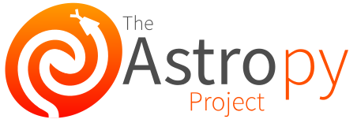

.. _astropy-org-index:

Astropy
=======

.. toctree::
   :maxdepth: 0
   :hidden:

   about
   acknowledging
   affiliated/index
   code_of_conduct
   contribute
   help
   history
   team

.. raw:: html

    

      

        

.. raw:: html
    

    

The Astropy Project is a community effort to develop a `common core package <https://docs.astropy.org>`__ for Astronomy in Python and foster an ecosystem of :ref:`astropy-org-affiliated`.
The Astropy community is committed to supporting the :ref:`astropy-org-coc`.

.. rst-class:: acknowledge

    Please remember to :ref:`acknowledge and cite <astropy-org-acknowledge>` the use of Astropy!

.. raw:: html

      

    

  

.. container:: text-center mx-auto

    .. rst-class:: whatsnew

    What's new in `Astropy 7.2 <https://docs.astropy.org/en/stable/whatsnew/7.2.html>`__

    .. raw:: html

        

            Latest stable release: 
        

Install Astropy
---------------

There are a number of ways of installing the latest release of the astropy core package. If you normally use ``pip`` to install Python packages, you can do:

.. code-block::

    pip install astropy[recommended] --upgrade

The astropy core package is also available in a number of other package managers, so be sure to check your preferred one!
Please see the :external+astropy-dev:ref:`astropy installation guide <installing-astropy>` for important details.

This guide covers creating a Python environment, installing with ``pip`` or ``conda``, building from source, requirements, and testing.

Learn Astropy
-------------

You can explore the functionality available in Astropy by checking out the `Tutorials <https://learn.astropy.org/>`__ and `Documentation <https://docs.astropy.org>`__.

.. grid:: 2
  :gutter: 1

  .. grid-item::
    :columns: auto

    .. button-link:: https://learn.astropy.org

      Tutorials

  .. grid-item::
    :columns: auto

    .. button-link:: https://docs.astropy.org/en/stable/index.html

      Documentation

Get Help
--------

If you have any questions regarding using Astropy there are numerous
channels for communication. Post to any one of several forums to get
help from our active, helpful, and friendly community of users and
developers.

.. button-ref:: astropy-org-help

   Get Help

Report bugs and Contribute
--------------------------

If you encounter something you believe to be a mistake, error, or bug, the best way to get it addressed is to report it on the `github issue tracker <http://github.com/astropy/astropy/issues>`__.
If you aren't sure if something is a bug or not, or if you don't have a Github account, feel free to ask on one of the :ref:`forums <astropy-org-help>`.
If you believe you know how to fix the problem, please consider :ref:`contributing <astropy-org-contribute>`!

.. grid:: 2
  :gutter: 1

  .. grid-item::
    :columns: auto

    .. button-link:: https://github.com/astropy/astropy/issues

      Report issues

  .. grid-item::
    :columns: auto

    .. button-ref:: astropy-org-contribute

      Contribute

Support Astropy
---------------

If you use Astropy in your work, we would be grateful if you could
include an acknowledgment in papers and/or presentations. See
:ref:`Acknowledging & Citing Astropy <astropy-org-acknowledge>` for details.

You can also purchase apparel and trinkets from
`the NumFOCUS shop <https://numfocus.myspreadshop.com/astropy+logo+-+transparent?idea=640f504c3c632427574844b9>`__,
and a portion of the profits go to support the project!

If you are interested in directly financially supporting Astropy
(either one-time or recurring), you can do so via our fiscal sponsor
NumFOCUS:

.. button-link:: https://numfocus.org/donate-to-astropy

    Donate to Astropy

Awards
------

- `Lancelot M. Berkeley–New York Community Trust Prize for Meritorious Work in Astronomy <https://aas.org/press/astropy-collaboration-receive-2025-berkeley-prize>`__ (2025)
- `IOP Publishing Top Cited Paper Awards North America <https://accreditations.ioppublishing.org/9ce7a38e-8ef1-4aa3-86f4-5760022a1574>`__ (2023)
- `ADASS Prize for an Outstanding Contribution to Astronomical Software <https://www.adass.org/softwareprize.html>`__ (2022)
- `Royal Astronomical Society Group Award (Astronomy) <https://ras.ac.uk/awards-and-grants/awards/2269-group-award-a>`__ (2020)

.. rst-class:: last

Zenodo Community
----------------

Documents, notes from previous meetings, and talks about Astropy are
collected in a Zenodo community for long-term archiving. Everyone is
encouraged to submit talks, etc. and other relevant materials.

.. button-link:: https://www.zenodo.org/communities/astropy

    Zenodo community

.. raw:: html

    

.. raw:: html

  

  
